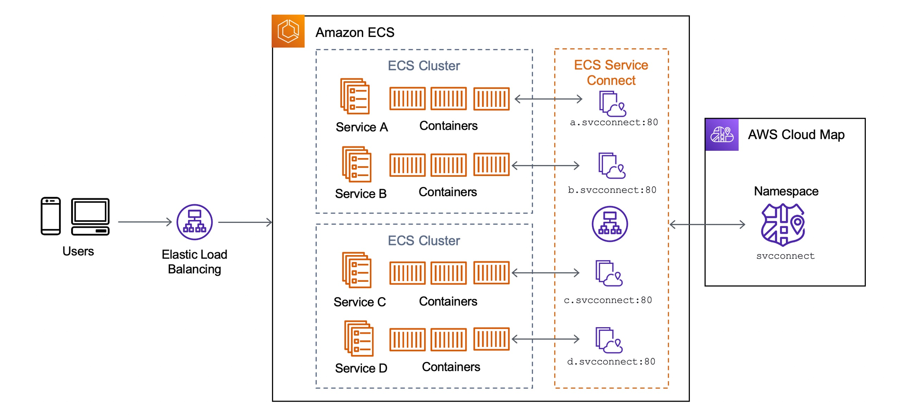

# **Módulo Terraform: cloudops-ref-repo-aws-ecs-service-terraform**

## Descripción:

Este módulo facilita la creación y gestión de servicios Amazon ECS (Elastic Container Service) en AWS con todas las mejores prácticas de seguridad, nomenclatura y configuración según los estándares organizacionales. Permite crear servicios ECS con soporte para múltiples contenedores, incluyendo contenedores sidecar, configuraciones de red, balanceadores de carga, auto-scaling, monitoreo y más.

Consulta [CHANGELOG.md](./CHANGELOG.md) para la lista de cambios de cada versión. *Recomendamos encarecidamente que en tu código fijes la versión exacta que estás utilizando para que tu infraestructura permanezca estable y actualices las versiones de manera sistemática para evitar sorpresas.*

## Diagrama de Arquitectura



*Nota: Este diagrama ilustra la arquitectura general de un servicio ECS con contenedores sidecar. La implementación específica puede variar según la configuración.*

## Características

- ✅ Creación de múltiples servicios ECS usando mapas de objetos
- ✅ Soporte para múltiples contenedores por servicio con configuraciones detalladas
- ✅ Soporte para contenedores sidecar con gestión de dependencias
- ✅ Configuración de volúmenes EFS con cifrado en tránsito
- ✅ Integración con balanceadores de carga
- ✅ Auto-scaling basado en métricas de CloudWatch
- ✅ Monitoreo y observabilidad con logs de CloudWatch
- ✅ Integración con módulo de monitoreo para alarmas y dashboards
- ✅ Soporte para encriptación de logs con AWS KMS
- ✅ Etiquetado consistente según estándares organizacionales
- ✅ Validaciones de entrada para prevenir configuraciones incorrectas
- ✅ Configuración de healthchecks para contenedores
- ✅ Soporte para AWS ECS Service Connect para comunicación entre servicios

## Estructura del Módulo

```
cloudops-ref-repo-aws-ecs-service-terraform/
├── .gitignore                # Archivos a ignorar por Git
├── CHANGELOG.md              # Registro de cambios del módulo
├── README.md                 # Documentación principal
├── data.tf                   # Recursos de datos
├── locals.tf                 # Variables locales y transformaciones
├── main.tf                   # Recursos principales
├── outputs.tf                # Salidas del módulo
├── providers.tf              # Configuración de proveedores
├── variables.tf              # Variables de entrada
├── Reglas_Modulos_Referencia.md # Reglas para módulos de referencia
└── sample/                   # Directorio con ejemplos de uso
    ├── solo-app/             # Ejemplo de servicio ECS con una sola aplicación
    │   ├── README.md         # Documentación del ejemplo
    │   ├── main.tf           # Configuración principal del ejemplo
    │   ├── providers.tf      # Configuración de proveedores del ejemplo
    │   ├── variables.tf      # Variables del ejemplo
    │   └── terraform.tfvars.example  # Ejemplo de valores de variables
    └── datadog-integration/  # Ejemplo de servicio ECS con integración Datadog
        ├── README.md         # Documentación del ejemplo
        ├── main.tf           # Configuración principal del ejemplo
        ├── providers.tf      # Configuración de proveedores del ejemplo
        ├── variables.tf      # Variables del ejemplo
        └── terraform.tfvars.example  # Ejemplo de valores de variables
```
## Implementación y Configuración

### Requisitos Técnicos

| Requisito | Versión |
|-----------|---------|
| Terraform | >= 1.10.0 |
| AWS Provider | >= 4.31.0 |

### Provider Configuration

El módulo requiere la configuración de un proveedor AWS con un alias específico:

```hcl
provider "aws" {
  region = "us-east-1"
  
  default_tags {
    tags = {
      environment = var.environment
      project     = var.project
      owner       = "cloudops"
      client      = var.client
      area        = "infrastructure"
      provisioned = "terraform"
      datatype    = "operational"
    }
  }
}

provider "aws" {
  alias  = "principal"
  region = "us-east-1"
  
  default_tags {
    tags = {
      environment = var.environment
      project     = var.project
      owner       = "cloudops"
      client      = var.client
      area        = "infrastructure"
      provisioned = "terraform"
      datatype    = "operational"
    }
  }
}

module "ecs_services" {
  source = "git::https://github.com/somospragma/cloudops-ref-repo-aws-ecs-service-terraform.git?ref=v1.0.0"
  
  providers = {
    aws.project = aws.principal
  }
  
  # Resto de la configuración...
}
```

### Configuración del Backend

Este módulo está diseñado para trabajar con un backend S3. Hay dos opciones recomendadas:

#### Opción 1: Solo S3

```hcl
terraform {
  backend "s3" {
    bucket         = "nombre-bucket-terraform-state"
    key            = "ruta/al/estado/terraform.tfstate"
    region         = "us-east-1"
    encrypt        = true
  }
}
```

#### Opción 2: S3 con DynamoDB (recomendado para entornos colaborativos)

```hcl
terraform {
  backend "s3" {
    bucket         = "nombre-bucket-terraform-state"
    key            = "ruta/al/estado/terraform.tfstate"
    region         = "us-east-1"
    dynamodb_table = "terraform-locks"
    encrypt        = true
  }
}
```

La segunda opción utiliza una tabla DynamoDB para gestionar el bloqueo de estado, lo que previene conflictos cuando múltiples usuarios trabajan simultáneamente.

### Convenciones de nomenclatura

Este módulo sigue las convenciones de nomenclatura estándar de la organización:

```
{client}-{project}-{environment}-resource-type-{name}
```

Por ejemplo:
- `pragma-api-dev-service-web`
- `pragma-api-dev-task-web`
- `pragma-api-dev-log-web`

### Estrategia de Etiquetado

El sistema de etiquetado se implementa en tres niveles:

1. **Etiquetas Transversales**: Definidas a nivel del proveedor AWS usando `default_tags`
2. **Etiquetas Específicas del Recurso**: Definidas en la propiedad `additional_tags` de cada recurso en la configuración del servicio ECS

Ejemplo de aplicación de etiquetas:

```hcl
ecs_services = {
  "api" = {
    # Otras configuraciones...
    
    additional_tags = {
      service-tier = "critical"
      backup-policy = "daily"
      data-classification = "internal"
    }
  }
}
```

### Recursos Gestionados

| Recurso | Descripción |
|---------|-------------|
| `aws_ecs_task_definition` | Definición de tarea ECS que especifica los contenedores y sus configuraciones |
| `aws_ecs_service` | Servicio ECS que mantiene las instancias de la tarea en ejecución |
| `aws_cloudwatch_log_group` | Grupo de logs para el servicio ECS |
| `aws_cloudwatch_log_group` (container) | Grupos de logs individuales para cada contenedor |
| `aws_appautoscaling_target` | Objetivo de Auto Scaling para el servicio ECS |
| `aws_appautoscaling_policy` | Políticas de Auto Scaling para el servicio ECS |
| `aws_cloudwatch_metric_alarm` | Alarmas de CloudWatch para monitorear el servicio |
### Parámetros de Entrada

| Nombre | Descripción | Tipo | Requerido |
|--------|-------------|------|----------|
| `client` | Nombre del cliente asociado a los servicios ECS | string | Sí |
| `project` | Nombre del proyecto asociado a los servicios ECS | string | Sí |
| `environment` | Entorno en el que se desplegarán los servicios ECS (dev, qa, pdn) | string | Sí |
| `ecs_services` | Configuración de servicios ECS | map(object) | Sí |

Para una descripción detallada de la estructura de `ecs_services`, consulta la sección "Estructura de Configuración".

### Estructura de Configuración

La variable principal `ecs_services` es un mapa de objetos donde cada clave representa un servicio ECS y su valor contiene toda la configuración necesaria:

```hcl
ecs_services = {
  "nombre-servicio" = {
    # Configuración del servicio
    cluster_name               = string
    desired_count              = number
    deployment_maximum_percent = optional(number, 200)
    deployment_minimum_percent = optional(number, 100)
    enable_execute_command     = optional(bool, false)
    force_new_deployment       = optional(bool, false)
    health_check_grace_period  = optional(number, 0)
    launch_type                = optional(string, "FARGATE")
    platform_version           = optional(string, "LATEST")
    scheduling_strategy        = optional(string, "REPLICA")
    pid_mode                   = optional(string, null)

    # Configuración de Capacity Providers
    use_capacity_providers = optional(bool, false)
    capacity_provider_strategy = optional(list(object({
      capacity_provider = string
      base              = optional(number, 0)
      weight            = optional(number, 1)
    })), [])

    # Configuración de red
    assign_public_ip = optional(bool, false)
    subnets          = list(string)
    security_groups  = list(string)

    # Configuración de definición de tarea
    task_cpu                 = number
    task_memory              = number
    requires_compatibilities = optional(list(string), ["FARGATE"])
    execution_role_arn       = string
    task_role_arn            = string

    # Configuración de contenedores
    containers = map(object({
      image                    = string
      cpu                      = optional(number, null)
      memory                   = optional(number, null)
      memory_reservation       = optional(number, null)
      essential                = optional(bool, true)
      readonly_root_filesystem = optional(bool, false)
      
      # Configuración adicional
      entry_point              = optional(list(string), null)
      command                  = optional(list(string), null)
      user                     = optional(string, null)
      docker_labels            = optional(map(string), {})
      
      # Configuración de puertos
      port_mappings = optional(list(object({
        name           = optional(string, null)
        container_port = number
        host_port      = optional(number, null)
        protocol       = optional(string, "tcp")
      })), [])

      # Configuración de entorno
      environment = optional(list(object({
        name  = string
        value = string
      })), [])

      # Configuración de secretos
      secrets = optional(list(object({
        name       = string
        value_from = string
      })), [])

      # Configuración de logs
      enable_cloudwatch_logs = optional(bool, true)
      
      # Configuración de healthcheck
      healthcheck = optional(object({
        command      = list(string)
        interval     = optional(number, 30)
        timeout      = optional(number, 5)
        retries      = optional(number, 3)
        start_period = optional(number, 0)
      }), null)

      # Configuración de montaje de volúmenes
      mount_points = optional(list(object({
        container_path = string
        source_volume  = string
        read_only      = optional(bool, false)
      })), [])

      # Configuración de dependencias (para sidecar)
      depends_on = optional(list(object({
        container_name = string
        condition      = string
      })), [])
    }))

    # Configuración de volúmenes
    volumes = optional(list(object({
      name = string
      efs_volume_configuration = optional(object({
        file_system_id          = string
        root_directory          = optional(string, "/")
        transit_encryption      = optional(string, "ENABLED")
        transit_encryption_port = optional(number, null)
        authorization_config = optional(object({
          access_point_id = string
          iam             = optional(string, "ENABLED")
        }), null)
      }), null)
      host_path = optional(string, null)
    })), [])

    # Configuración de balanceador de carga
    load_balancer = optional(object({
      target_group_arn = string
      container_name   = string
      container_port   = number
    }), null)

    # Configuración de Service Connect
    service_connect_config = optional(object({
      enabled   = optional(bool, false)
      namespace = optional(string, null)
      service = optional(object({
        port_name      = string
        discovery_name = optional(string, null)
        client_alias = optional(list(object({
          port     = number
          dns_name = string
        })), [])
      }), null)
    }), null)

    # Configuración de Auto Scaling
    enable_autoscaling = optional(bool, false)
    autoscaling_config = optional(object({
      min_capacity = optional(number, 1)
      max_capacity = optional(number, 10)
      scaling_policies = optional(list(object({
        name        = string
        policy_type = optional(string, "TargetTrackingScaling")
        target_tracking_configuration = optional(object({
          target_value           = number
          scale_in_cooldown      = optional(number, 300)
          scale_out_cooldown     = optional(number, 300)
          predefined_metric_type = string
          disable_scale_in       = optional(bool, false)
        }), null)
      })), [])
    }), null)

    # Configuración de logs
    log_retention_days     = optional(number, 30)
    log_encryption_key_arn = optional(string, null)

    # Etiquetas adicionales
    additional_tags = optional(map(string), {})
  }
}
```

### Valores de Salida

| Nombre | Descripción |
|--------|-------------|
| `ecs_services` | Información de los servicios ECS creados |
| `task_definitions` | Información de las definiciones de tareas ECS creadas |
| `cloudwatch_log_groups` | Información de los grupos de logs de CloudWatch creados |
| `container_log_groups` | Información de los grupos de logs de CloudWatch para contenedores |
| `autoscaling_targets` | Información de los objetivos de Auto Scaling |
| `autoscaling_policies` | Información de las políticas de Auto Scaling |
| `cloudwatch_alarms` | Información de las alarmas de CloudWatch |
| `load_balancer_config` | Configuración del balanceador de carga para depuración |

### Ejemplos de Uso

#### Ejemplo Básico

```hcl
module "ecs_services" {
  source = "git::https://github.com/somospragma/cloudops-ref-repo-aws-ecs-service-terraform.git?ref=v1.0.0"
  
  providers = {
    aws.project = aws.principal
  }
  
  client      = "pragma"
  project     = "api"
  environment = "dev"
  
  ecs_services = {
    "api" = {
      cluster_name    = "pragma-api-dev-cluster"
      desired_count   = 2
      task_cpu        = 1024
      task_memory     = 2048
      subnets         = ["subnet-12345678", "subnet-87654321"]
      security_groups = ["sg-12345678"]
      execution_role_arn = "arn:aws:iam::123456789012:role/ecsTaskExecutionRole"
      task_role_arn      = "arn:aws:iam::123456789012:role/ecsTaskRole"
      
      containers = {
        "app" = {
          image = "123456789012.dkr.ecr.us-east-1.amazonaws.com/api:latest"
          port_mappings = [
            {
              container_port = 8080
            }
          ]
          environment = [
            {
              name  = "ENV"
              value = "development"
            }
          ]
        }
      }
      
      load_balancer = {
        target_group_arn = "arn:aws:elasticloadbalancing:us-east-1:123456789012:targetgroup/api/abcdef1234567890"
        container_name   = "app"
        container_port   = 8080
      }
      
      log_retention_days = 30
      
      additional_tags = {
        service-tier = "critical"
      }
    }
  }
}
```

#### Ejemplo con Sidecar

```hcl
module "ecs_services" {
  source = "git::https://github.com/somospragma/cloudops-ref-repo-aws-ecs-service-terraform.git?ref=v1.0.0"
  
  providers = {
    aws.project = aws.principal
  }
  
  client      = "pragma"
  project     = "api"
  environment = "dev"
  
  ecs_services = {
    "api" = {
      cluster_name    = "pragma-api-dev-cluster"
      desired_count   = 2
      task_cpu        = 1024
      task_memory     = 2048
      subnets         = ["subnet-12345678", "subnet-87654321"]
      security_groups = ["sg-12345678"]
      execution_role_arn = "arn:aws:iam::123456789012:role/ecsTaskExecutionRole"
      task_role_arn      = "arn:aws:iam::123456789012:role/ecsTaskRole"
      
      containers = {
        "app" = {
          image = "123456789012.dkr.ecr.us-east-1.amazonaws.com/api:latest"
          cpu   = 512
          memory = 1024
          port_mappings = [
            {
              name = "api"  # Nombre para Service Connect
              container_port = 8080
            }
          ]
          healthcheck = {
            command     = ["CMD-SHELL", "curl -f http://localhost:8080/health || exit 1"]
            interval    = 30
            timeout     = 5
            retries     = 3
            start_period = 60
          }
        },
        "sidecar" = {
          image = "123456789012.dkr.ecr.us-east-1.amazonaws.com/sidecar:latest"
          cpu   = 256
          memory = 512
          essential = true
          environment = [
            {
              name  = "MAIN_APP_PORT"
              value = "8080"
            }
          ]
          depends_on = [
            {
              container_name = "app"
              condition      = "START"
            }
          ]
        }
      }
      
      load_balancer = {
        target_group_arn = "arn:aws:elasticloadbalancing:us-east-1:123456789012:targetgroup/api/abcdef1234567890"
        container_name   = "app"
        container_port   = 8080
      }
      
      additional_tags = {
        service-tier = "critical"
      }
    }
  }
}
```
## Escenarios de Uso Comunes

### Servicio ECS con un solo contenedor

Este es el escenario más básico donde se despliega un servicio ECS con un solo contenedor:

```hcl
ecs_services = {
  "web" = {
    cluster_name    = "mi-cluster"
    desired_count   = 2
    task_cpu        = 1024
    task_memory     = 2048
    subnets         = ["subnet-12345678", "subnet-87654321"]
    security_groups = ["sg-12345678"]
    execution_role_arn = "arn:aws:iam::123456789012:role/ecsTaskExecutionRole"
    task_role_arn      = "arn:aws:iam::123456789012:role/ecsTaskRole"
    
    containers = {
      "app" = {
        image = "123456789012.dkr.ecr.us-east-1.amazonaws.com/web:latest"
        port_mappings = [
          {
            container_port = 80
          }
        ]
      }
    }
    
    load_balancer = {
      target_group_arn = "arn:aws:elasticloadbalancing:us-east-1:123456789012:targetgroup/web/abcdef1234567890"
      container_name   = "app"
      container_port   = 80
    }
  }
}
```

### Servicio ECS con contenedor sidecar para monitoreo

Este escenario implementa un servicio ECS con un contenedor principal y un sidecar para monitoreo (como Datadog):

```hcl
ecs_services = {
  "api" = {
    cluster_name    = "mi-cluster"
    desired_count   = 2
    task_cpu        = 1024
    task_memory     = 2048
    subnets         = ["subnet-12345678", "subnet-87654321"]
    security_groups = ["sg-12345678"]
    execution_role_arn = "arn:aws:iam::123456789012:role/ecsTaskExecutionRole"
    task_role_arn      = "arn:aws:iam::123456789012:role/ecsTaskRole"
    
    containers = {
      "app" = {
        image = "123456789012.dkr.ecr.us-east-1.amazonaws.com/api:latest"
        cpu   = 512
        memory = 1024
        port_mappings = [
          {
            container_port = 8080
          }
        ]
      },
      "datadog-agent" = {
        image = "public.ecr.aws/datadog/agent:latest"
        cpu   = 256
        memory = 512
        essential = false
        environment = [
          {
            name  = "DD_API_KEY"
            value = "your-datadog-api-key"
          },
          {
            name  = "DD_APM_ENABLED"
            value = "true"
          },
          {
            name  = "DD_APM_NON_LOCAL_TRAFFIC"
            value = "true"
          }
        ]
      }
    }
    
    load_balancer = {
      target_group_arn = "arn:aws:elasticloadbalancing:us-east-1:123456789012:targetgroup/api/abcdef1234567890"
      container_name   = "app"
      container_port   = 8080
    }
  }
}
```

### Servicio ECS con volumen EFS

Este escenario implementa un servicio ECS con un volumen EFS para almacenamiento persistente:

```hcl
ecs_services = {
  "app" = {
    cluster_name    = "mi-cluster"
    desired_count   = 2
    task_cpu        = 1024
    task_memory     = 2048
    subnets         = ["subnet-12345678", "subnet-87654321"]
    security_groups = ["sg-12345678"]
    execution_role_arn = "arn:aws:iam::123456789012:role/ecsTaskExecutionRole"
    task_role_arn      = "arn:aws:iam::123456789012:role/ecsTaskRole"
    
    containers = {
      "app" = {
        image = "123456789012.dkr.ecr.us-east-1.amazonaws.com/app:latest"
        port_mappings = [
          {
            container_port = 8080
          }
        ]
        mount_points = [
          {
            container_path = "/data"
            source_volume  = "persistent-data"
            read_only      = false
          }
        ]
      }
    }
    
    volumes = [
      {
        name = "persistent-data"
        efs_volume_configuration = {
          file_system_id = "fs-12345678"
          root_directory = "/"
          transit_encryption = "ENABLED"
          authorization_config = {
            access_point_id = "fsap-12345678abcdef123"
            iam             = "ENABLED"
          }
        }
      }
    ]
    
    load_balancer = {
      target_group_arn = "arn:aws:elasticloadbalancing:us-east-1:123456789012:targetgroup/app/abcdef1234567890"
      container_name   = "app"
      container_port   = 8080
    }
  }
}
```

### Servicio ECS con Auto Scaling

Este escenario implementa un servicio ECS con configuración de Auto Scaling basado en métricas de CPU y memoria:

```hcl
ecs_services = {
  "api" = {
    cluster_name    = "mi-cluster"
    desired_count   = 2
    task_cpu        = 1024
    task_memory     = 2048
    subnets         = ["subnet-12345678", "subnet-87654321"]
    security_groups = ["sg-12345678"]
    execution_role_arn = "arn:aws:iam::123456789012:role/ecsTaskExecutionRole"
    task_role_arn      = "arn:aws:iam::123456789012:role/ecsTaskRole"
    
    containers = {
      "app" = {
        image = "123456789012.dkr.ecr.us-east-1.amazonaws.com/api:latest"
        port_mappings = [
          {
            container_port = 8080
          }
        ]
      }
    }
    
    load_balancer = {
      target_group_arn = "arn:aws:elasticloadbalancing:us-east-1:123456789012:targetgroup/api/abcdef1234567890"
      container_name   = "app"
      container_port   = 8080
    }
    
    enable_autoscaling = true
    autoscaling_config = {
      min_capacity = 2
      max_capacity = 10
      scaling_policies = [
        {
          name = "cpu-tracking"
          policy_type = "TargetTrackingScaling"
          target_tracking_configuration = {
            target_value       = 70.0
            scale_in_cooldown  = 300
            scale_out_cooldown = 300
            predefined_metric_type = "ECSServiceAverageCPUUtilization"
          }
        },
        {
          name = "memory-tracking"
          policy_type = "TargetTrackingScaling"
          target_tracking_configuration = {
            target_value       = 80.0
            scale_in_cooldown  = 300
            scale_out_cooldown = 300
            predefined_metric_type = "ECSServiceAverageMemoryUtilization"
          }
        }
      ]
    }
  }
}
```

## Consideraciones Operativas

### Rendimiento y Escalabilidad

- **Tamaño de tarea**: Asigna CPU y memoria adecuadas según las necesidades de tu aplicación
- **Auto Scaling**: Configura políticas de escalado automático para manejar picos de tráfico
- **Límites de servicio**: Ten en cuenta los límites de servicio de AWS ECS (número máximo de tareas por servicio, etc.)
- **Estrategia de despliegue**: Utiliza `deployment_maximum_percent` y `deployment_minimum_percent` para controlar la estrategia de despliegue

### Limitaciones y Restricciones

- El módulo está optimizado para trabajar con el tipo de lanzamiento FARGATE, aunque también soporta EC2
- Para usar volúmenes EFS, el sistema de archivos y los puntos de acceso deben estar configurados previamente
- Los roles IAM para la ejecución y las tareas deben existir previamente
- Las imágenes de contenedor deben estar disponibles en un registro accesible

### Costos y Optimización

- Utiliza Auto Scaling para ajustar automáticamente la capacidad según la demanda
- Considera el uso de Fargate Spot para cargas de trabajo tolerantes a interrupciones
- Optimiza el tamaño de las tareas para evitar sobreprovisionar recursos
- Configura la retención de logs adecuada para evitar costos innecesarios de almacenamiento

### Recomendaciones de Implementación

- Implementa healthchecks en todos los contenedores para mejorar la fiabilidad
- Utiliza secretos para gestionar información sensible en lugar de variables de entorno
- Configura alarmas de CloudWatch para monitorear el rendimiento y la salud del servicio
- Implementa una estrategia de registro y monitoreo adecuada para facilitar la solución de problemas
## Seguridad y Cumplimiento

### Consideraciones de seguridad

- **Roles IAM**: Utiliza el principio de privilegio mínimo al configurar los roles de ejecución y tarea
- **Grupos de seguridad**: Configura reglas de entrada y salida restrictivas
- **Secretos**: Utiliza AWS Secrets Manager o SSM Parameter Store para gestionar información sensible
- **Cifrado**: Habilita el cifrado en tránsito para volúmenes EFS y cifrado de logs con KMS
- **Contenedores**: Configura `readonly_root_filesystem = true` cuando sea posible para mejorar la seguridad

### Mejores Prácticas Implementadas

- **Seguridad**: Configuración de grupos de seguridad, cifrado en tránsito para volúmenes EFS
- **Monitoreo**: Logs de CloudWatch con retención configurable, alarmas para métricas críticas
- **Alta Disponibilidad**: Soporte para despliegue en múltiples subredes, integración con balanceadores de carga
- **Escalabilidad**: Configuración de Auto Scaling basado en métricas de uso
- **Etiquetado**: Implementación de etiquetas estándar y soporte para etiquetas adicionales específicas
- **Comunicación entre servicios**: Soporte para Service Connect para simplificar la comunicación entre servicios

### Lista de Verificación de Cumplimiento

- [x] Nomenclatura de recursos conforme al estándar organizacional
- [x] Etiquetas obligatorias aplicadas a todos los recursos
- [x] Validaciones para garantizar configuraciones correctas
- [x] Soporte para cifrado en tránsito
- [x] Soporte para cifrado de logs
- [x] Configuración de healthchecks
- [x] Integración con balanceadores de carga
- [x] Soporte para Auto Scaling
- [x] Gestión de dependencias entre contenedores
- [x] Configuración de volúmenes seguros

## Observaciones

### Notas Importantes

- Este módulo asume que ya existe un cluster ECS.
- Los roles IAM para la ejecución y las tareas deben existir previamente.
- Para usar volúmenes EFS, el sistema de archivos y los puntos de acceso deben estar configurados.
- Las imágenes de contenedor deben estar disponibles en un registro accesible.
- Las etiquetas transversales (owner, environment, project, etc.) deben configurarse en el provider AWS usando default_tags.

### Consejos para Casos de Uso Específicos

#### Contenedores Sidecar

Para implementar contenedores sidecar de manera efectiva:

1. Configura las dependencias correctamente usando `depends_on`
2. Asigna recursos (CPU, memoria) adecuados a cada contenedor
3. Establece `essential = true` solo para los contenedores críticos
4. Utiliza `localhost` para la comunicación entre contenedores dentro de la misma tarea

#### Volúmenes EFS

Para utilizar volúmenes EFS de manera segura:

1. Configura siempre `transit_encryption = "ENABLED"`
2. Utiliza puntos de acceso EFS para mejorar la seguridad
3. Configura los permisos adecuados en el sistema de archivos EFS
4. Considera el impacto en el rendimiento al utilizar EFS

#### Service Connect

Para aprovechar al máximo AWS ECS Service Connect:

1. Asigna nombres a los mapeos de puertos usando el campo `name`
2. Configura `discovery_name` para facilitar la localización del servicio
3. Utiliza `client_alias` para crear nombres DNS amigables
4. Asegúrate de que el namespace de Service Connect esté configurado correctamente

---

> Este módulo ha sido desarrollado siguiendo los estándares de Pragma CloudOps, garantizando una implementación segura, escalable y optimizada que cumple con todas las políticas de la organización. Pragma CloudOps recomienda revisar este código con su equipo de infraestructura antes de implementarlo en producción.
